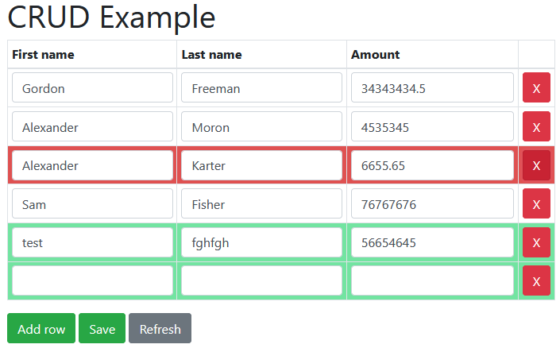

# Spring Boot CRUD inline table edit example



My dirty implementation of table editor.
Not the best, but I can't find any of good examples of inline row editing.

Database engine is H2.

## Running

```
mvnw spring-boot:run
```